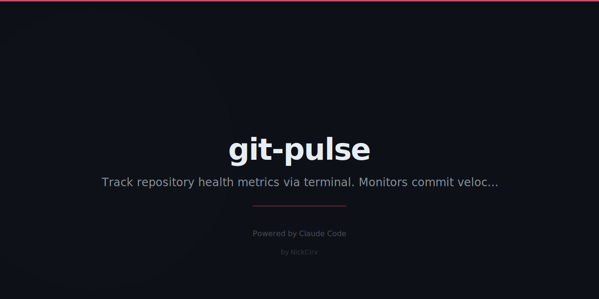

# git-pulse

<p align="center">
  
</p>

<p align="center">
  
  
  
  
</p>

Beautiful terminal dashboard for any git repository. Get commit stats, contributor breakdowns, activity heatmaps, and a health score — all from your local repo, no API keys required.

---

## The Problem

`git log` is powerful but ugly. GitHub gives you graphs but only for repos it hosts. There's no fast, local, beautiful way to see the pulse of a codebase at a glance.

git-pulse fixes that.

---

## Quick Start

```bash
# Install globally
npm install -g git-pulse

# Run in any git repo
cd your-project
git-pulse

# Or point at a path
git-pulse --path /path/to/repo
```

---

## Example Output

```
  ╭──────────────────────────────────────────────────────────╮
  │        git-pulse · my-awesome-project                    │
  ╰──────────────────────────────────────────────────────────╯

  Overview
  ──────────────────────────────────────────────────
  Repository                my-awesome-project
  Current Branch            main
  Total Commits             1,243
  Contributors              8
  Tracked Files             312
  Tags / Releases           14  (latest: v2.3.1)

  Commit Activity
  ──────────────────────────────────────────────────
  First Commit              03 Jan 2023
  Last Commit               27 Feb 2026
  Commits (last 30d)        47
  Avg Commits / Day         1.12

  Last 30 days  ████████████ 47 commits

  Activity Heatmap  — last 52 weeks
  ──────────────────────────────────────────────────
       Jan   Feb   Mar   Apr   May   Jun  ...
  Mon  █ █ █ █ ░ █ █ ░ ░ █ █ ░ ░ █ ...
  Wed  ░ █ ░ █ █ █ ░ ░ █ ░ █ █ ░ ░ ...
  Fri  █ ░ █ ░ ░ █ █ █ ░ █ ░ █ █ █ ...

  Repository Health Score
  ──────────────────────────────────────────────────
  ✔  Has README                  10/10 pts
  ✔  Has LICENSE                 10/10 pts
  ✔  Has tests                   15/15 pts
  ✔  Has CI config               10/10 pts
  ✔  Commit recency              15/15 pts
  ✔  Contributor count           10/10 pts
  ✔  Branch hygiene              10/10 pts
  ✔  Tagged releases             10/10 pts
  ✔  No large files              10/10 pts

  ██████████████████████████████ 100/100  A+
```

---

## Features

- **Dashboard** — full repo overview in one shot
- **Activity heatmap** — GitHub-style contribution graph for the last 52 weeks, rendered in terminal with chalk green shades
- **Contributor table** — ranked by commits with lines added/removed, last active date, and percentage of total work
- **Health score** — 0–100 score across 9 checks: README, LICENSE, tests, CI, commit recency, contributor count, branch hygiene, tagged releases, no large files
- **No API keys** — 100% local git data via `execFileSync`
- **Any repo** — run in the current directory or pass `--path`

---

## Commands

```bash
git-pulse                      # Full dashboard (default)
git-pulse contributors         # Top contributors ranked table
git-pulse contributors -n 5    # Show top 5 only
git-pulse activity             # ASCII heatmap only
git-pulse health               # Health score only
git-pulse --path /some/repo    # Run on a specific path
git-pulse --version            # Show version
git-pulse --help               # Show help
```

---

## How It Works

git-pulse uses only `execFileSync('git', [...args])` — no shell string injection, no third-party git libraries. Every metric is computed from standard git commands:

| Metric | Git command |
|--------|-------------|
| Total commits | `git rev-list --count HEAD` |
| Contributors | `git shortlog -s HEAD` |
| Branches | `git branch -a` |
| Tags | `git tag` |
| Activity dates | `git log --format=%aI` |
| Lines changed | `git log --numstat` |
| Working tree | `git diff`, `git ls-files --others` |

Health checks read the filesystem directly (`existsSync`, `statSync`) — no exec needed.

---

## Requirements

- **Node 18+**
- **git** installed and on your PATH
- A git repository with at least one commit

---

## See Also

- [cirv-box](https://github.com/NickCirv/cirv-box) — WordPress schema injection plugin
- [cirv-guard](https://github.com/NickCirv/cirv-guard) — WordPress security monitoring plugin
- [agent-viewer](https://github.com/NickCirv/agent-viewer) — Terminal command center for AI agents

---

## License

MIT © [NickCirv](https://github.com/NickCirv)
